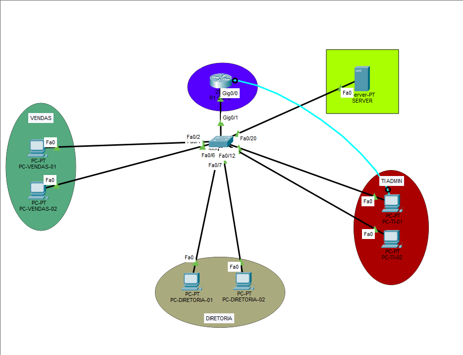
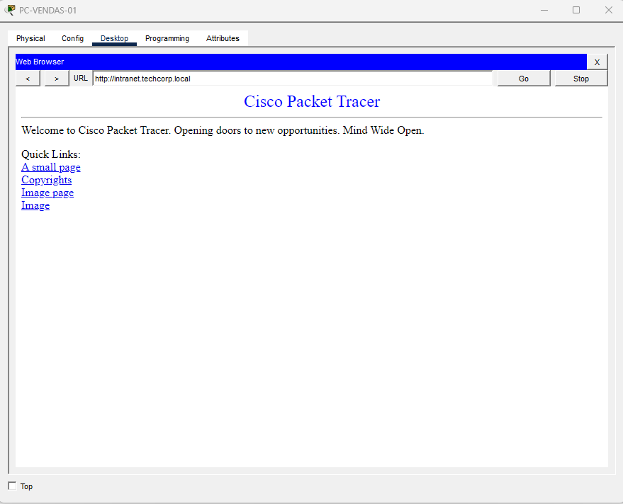

# 🌐 Simulação de Rede Corporativa Segura (Cisco Packet Tracer)


Projeto prático focado na concepção, segmentação e segurança de uma infraestrutura de rede corporativa de médio porte. O objetivo principal é demonstrar domínio em roteamento inter-VLAN, automação de serviços (DHCP/DNS) e políticas de controle de acesso (ACLs).

---

## 📐 Topologia da Rede



---

## 🎯 Objetivos do Projeto

- **Segmentação Lógica:** Isolamento de departamentos utilizando VLANs para mitigar domínios de broadcast.
- **Roteamento Inter-VLAN:** Comunicação eficiente via subinterfaces no roteador corporativo (*Router-on-a-Stick*).
- **Serviços de Rede:** Configuração do roteador como Servidor DHCP e integração com Servidor DNS/HTTP interno.
- **Segurança e Controle de Acesso:** Implementação de ACLs estendidas para restringir o tráfego entre setores críticos.

---

## 📊 Plano de Endereçamento IP e VLANs

| VLAN | Nome | Rede / Máscara | Gateway | Tipo de IP | Descrição / Permissões |
| :---: | :--- | :--- | :--- | :--- | :--- |
| **10** | Vendas | `192.168.10.0/24` | `192.168.10.1` | DHCP | Acesso à Internet e Servidores; Bloqueado para VLAN TI. |
| **20** | Diretoria | `192.168.20.0/24` | `192.168.20.1` | DHCP | Acesso total à rede corporativa e Servidores. |
| **30** | TI_Admin | `192.168.30.0/24` | `192.168.30.1` | Estático | Acesso irrestrito de gerenciamento a switches e roteadores. |
| **99** | Servidores | `192.168.99.0/24` | `192.168.99.1` | Estático | Hospeda DNS e Intranet Web (`192.168.99.10`). |

---

## ⚙️ Funcionalidades Implementadas

### 1. Switched Virtual Networks (VLANs) e Trunking
- Criação e nomeação das VLANs no switch de acesso (`SW-ACC-1`).
- Configuração de trunking **802.1Q** no link inter-device (`GigabitEthernet 0/1`).

### 2. Roteamento Inter-VLAN (*Router-on-a-Stick*)
- Divisão da interface física `GigabitEthernet 0/0` do `R1-CORE` em subinterfaces atreladas às VLANs 10, 20, 30 e 99.

### 3. Serviços Essenciais (DHCP, DNS e Web)
- Pools DHCP configurados no `R1-CORE` para distribuição dinâmica de IP para as VLANs 10 e 20.
- Servidor dedicado (`SRV-CORP`) respondendo por resoluções DNS para a URL `intranet.techcorp.local`.

### 4. Políticas de Segurança (ACLs)
- **ACL Estendida (`BLOQUEIA-VENDAS-TI`):** Impede que hosts da VLAN Vendas acessem dispositivos da VLAN TI/Admin via ICMP/IP, mantendo o acesso liberado apenas aos Servidores Corporativos.

---

## 🧪 Validação e Testes de Conectividade

Foram realizados testes no terminal dos computadores para validar o roteamento e a eficácia da política de segurança:

1. **Ping Inter-VLAN (Vendas -> Servidores):** Sucesso (`Reply from 192.168.99.10`).
2. **Filtro de Segurança (Vendas -> TI):** Bloqueado com sucesso (`Destination host unreachable` via ACL).
3. **Resolução DNS e Acesso Web:** Sucesso ao navegar no endereço `http://intranet.techcorp.local`.




---

## 🛠️ Como Executar este Projeto

1. Clone ou faça o download deste repositório:
   ```bash
   git clone [https://github.com/SEU-USUARIO/simulacao-rede-corporativa-cisco.git](https://github.com/SEU-USUARIO/simulacao-rede-corporativa-cisco.git)
